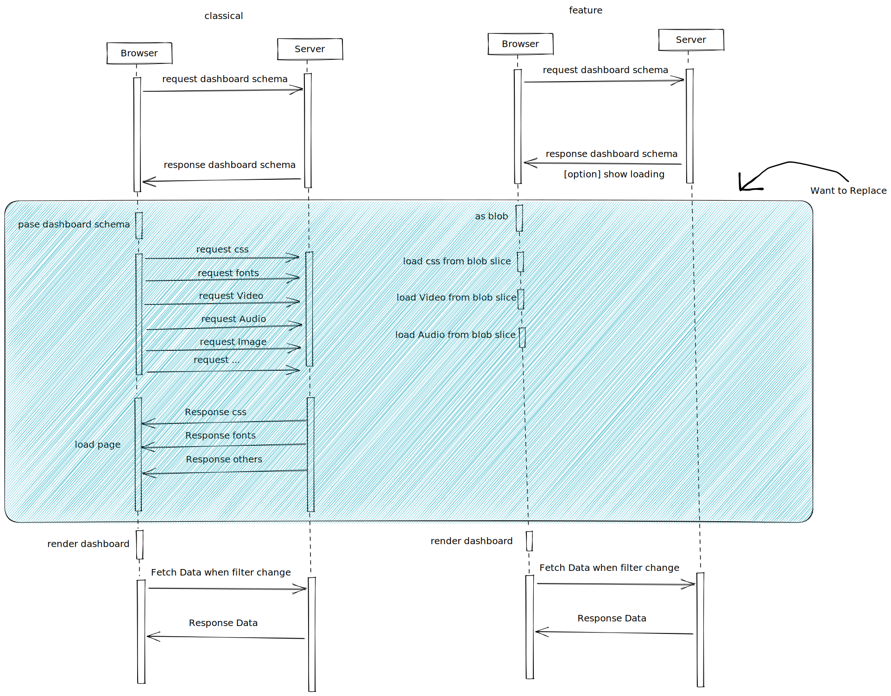
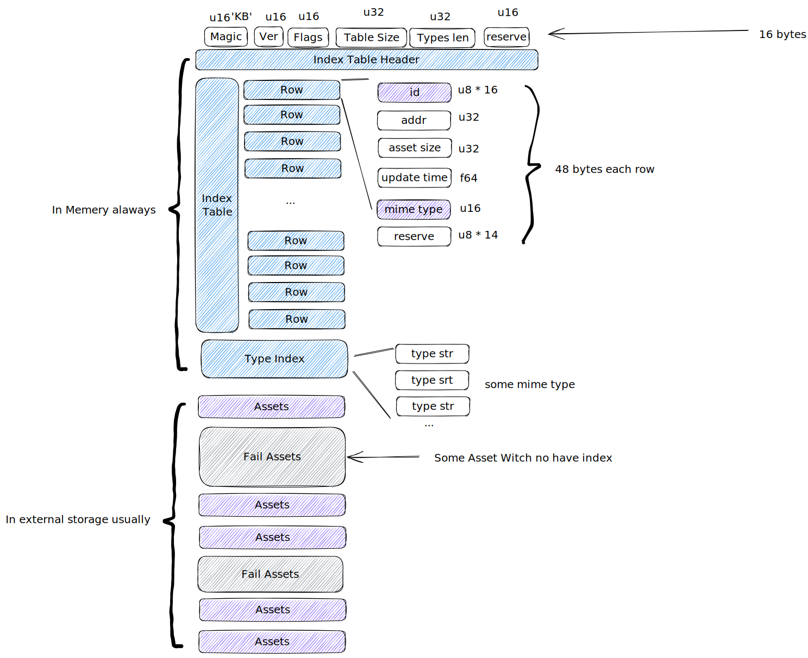

# KeyBase

KeyBase is A Library For all in one data file with web application.

# Motivation

I want to fetch all data for dashboard application in once time. such as `css` `fonts` `video` `audio` `image` `3DModel`. so i need a this library help me manager there content in Browser.

# Stroage

I designer a struct for stroage look like this:

- Index Table Header: `Index Table Header` include `ver` `flags` and `table size`.
    - ver: an `u32` as spec version
    - flags: an `u32`
    - table size: an `u64` as count of index table row.
- Index Table: `Index Table` is an array with `Row`. there has `key` `addr` `assets size` in each row.
    - key: an uuid as asset id.
    - addr: an `u64` as offset of asset.
    - assets size: an `u64` as size of asset.
- Type Index: `Type Index` is a set of string, section end of an `\0x0\0x0`.
- Assets: `Assets` is some data segments .